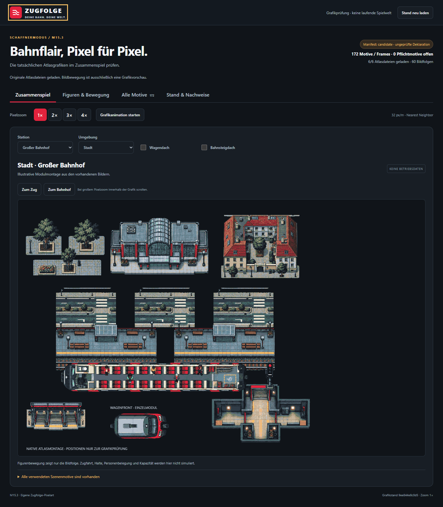

# M15.3 — Prüfnachweis des Grafikkandidaten

Der vollständige Katalog liegt als technisch geprüfter Kandidat vor: **172
Motive, 60 Animationssequenzen, sechs PNG-Atlanten**. Die finale Freigabe und
produktive Signatur fehlen noch; [#213](https://github.com/larynxberlin-rgb/Zugfolge/issues/213)
bleibt deshalb offen. Der [Fachvertrag](../art-atlas.md) gilt unverändert.

## Artefakte und Herkunft

- [Korpus, Originale und tatsächliche Prompts](../../assets/conductor-art/v1/README.md)
- [Manifest](../../assets/conductor-art/v1/manifest.json) und
  [explizit ausstehende Freigaben](../../assets/conductor-art/v1/review.json)
- [Technische Bildsichtung mit Korrekturen und Dateihashes](../../assets/conductor-art/v1/evidence/technical-visual-review.md)
- [Browsernachweis mit Screenshot- und PNG-Hashes](browser-report.json)

Die fünf Figuren bieten je vier Richtungen, Stillstand, vier Gehphasen und
Sitzpose. Hinzu kommen Innenraummodule, Wagen, drei Bahnhofsklassen, Umland,
Vorstadt, Stadt, Signalbilder sowie Rollstuhl, Fahrrad und Kinderwagen.
Vier sichtbare Fahrgastsets decken deterministisch alle 256 Erscheinungswerte
aus M15.2 ab. Die 25 RGBA-Paletteneinträge enthalten transparente Pixel und die
verbindlichen Graphit-/Rotfarben. Ganzzahliger Zoom verwendet Nearest Neighbor.

Die Original-PNGs enthalten die tatsächliche Providerdeklaration `gpt-image`,
Version `2.0`; der Extraktionsweg und die CBOR-Bytes sind nachvollziehbar.
Es wird keine C2PA-Zertifikatsprüfung oder interne Modellrevision behauptet.
Die ausdrücklich erlaubte technische Aufbereitung zeichnet keine Motive nach.

## Sichtbarer Nachweis

Die lokale Galerie lädt die tatsächlichen Atlanten. Sie lässt Stationsklasse,
Umgebung, Dachansicht, Figurenpose, Animation und Zoom wechseln und zeigt den
vollständigen Katalog. Sie ist ausdrücklich eine Grafikprüfung ohne Spielwelt.

[Kleiner Bahnhof und Umland](screenshots/scene-small-rural-1x.png),
[mittlerer Bahnhof und Vorstadt](screenshots/scene-medium-suburban-1x.png),
[Dachansicht](screenshots/scene-roofs-1x.png),
[fünf Figuren in allen Sitzrichtungen](screenshots/actors-sitting-2x.png) und
[schmale Ansicht bei 320 Pixeln](screenshots/mobile-320-actors.png) ergänzen
die vollständige Kontaktübersicht.

## Ausgeführte Prüfung

- Neun Pakettests prüfen unter anderem falsche Welt-/Releasepins, Signaturen,
  manipulierte PNGs, Raster-/Palettenfehler, identische Gehphasen, fehlende
  Modellbelege und defensive Kopien der geladenen Daten.
- Die reale Korpusprüfung dekodiert alle sechs PNGs mit zusammen 4.603.904
  Pixeln. Sie prüft die vollständigen 172 Motive und 60 Animationen sowie
  sämtliche referenzierten Belegbytes. Offen bleiben ausschließlich die
  ausdrücklich ausgewiesenen Freigaben; `activationEligible` ist `false`.
- Zwei Browser-/Servertests mit echtem Edge prüfen unter anderem geladene
  Originalhashes, Zoom 1–4, Pause, reduzierte Bewegung, Tastaturbedienung und
  390/320-Pixel-Ansichten ohne äußeren horizontalen Überlauf. Der versionierte
  Bericht enthält 13 Screenshots und bindet sie an ihre tatsächlichen Bytes.
- Die technische Aufbereitung wird aus vorhandenen Originalen wiederholt.
  JSON und Text verwenden feste LF-Zeilenenden, damit Git-Checkouts unter
  Windows und Linux die Dateihashes nicht verändern.

Reproduktionsbefehle stehen im [Korpus-README](../../assets/conductor-art/v1/README.md).
Für eine neue Browserprüfung kann `ART_PREVIEW_SCREENSHOT_DIR` auf einen
separaten Ausgabepfad zeigen. Die bestehenden Nachweise sind kein automatisch
erteiltes Freigabeurteil und kein plattformübergreifender Pixelvergleich.

## Verbleibende Abnahme

Die vier formalen Assetgates, Referenzrechtefreigaben und der Release-Review
sind in `review.json` noch ausstehend. Der dokumentierte Codex-Sichtbefund
ersetzt diese Einträge nicht. Erst ein belegter Review, der strenge Checker
ohne `--allow-pending` und eine gültige Signatur über den exakten Manifesthash
erlauben dem weltgebundenen Loader, den Atlas zu aktivieren. Es wurde kein
Produktionsschlüssel erzeugt oder Weltpin geändert.

M15.4 liefert weiterhin die begehbare Geometrie aus tatsächlichen
Fahrzeugkonfigurationen; M15.5 bindet Stationen und Umgebung an den laufenden
Betrieb. Die [M15.1/M15.2-Grenzen](../m15-abnahme.md) einschließlich echter
M10-Haltquittungen bleiben bestehen. PR #531 und die M10-PR-Kette sind als
Basis berücksichtigt; vorhandene UI-Grafiken ersetzen keine Korpusbestandteile.
