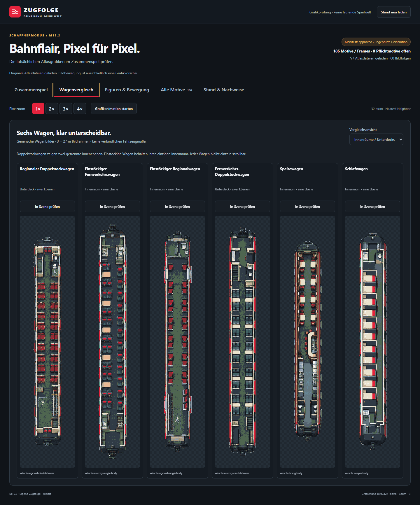

# M15.3 — Prüfnachweis des Grafikkandidaten

Der vollständige Katalog v2 liegt als technisch geprüfter Kandidat vor: **186
Motive, 60 Animationssequenzen, sieben PNG-Atlanten**. Die finale Freigabe und
produktive Signatur fehlen noch; [#213](https://github.com/larynxberlin-rgb/Zugfolge/issues/213)
bleibt deshalb offen. Der [Fachvertrag](../art-atlas.md) gilt unverändert.

## Artefakte und Herkunft

- [Korpus, Originale und tatsächliche Prompts](../../assets/conductor-art/v1/README.md)
- [Manifest](../../assets/conductor-art/v1/manifest.json) und
  [explizit ausstehende Freigaben](../../assets/conductor-art/v1/review.json)
- [Technische Bildsichtung mit Korrekturen und Dateihashes](../../assets/conductor-art/v1/evidence/technical-visual-review.md)
- [Sichtung der sechs neuen Wagenfamilien und Herkunft der Treppenkorrektur](../../assets/conductor-art/v1/evidence/vehicle-visual-review.md)
- [Browsernachweis mit Screenshot- und PNG-Hashes](browser-report.json)

Die fünf Figuren bieten je vier Richtungen, Stillstand, vier Gehphasen und
Sitzpose. Hinzu kommen Innenraummodule, Wagen, drei Bahnhofsklassen, Umland,
Vorstadt, Stadt, Signalbilder sowie Rollstuhl, Fahrrad und Kinderwagen.
Vier sichtbare Fahrgastsets decken deterministisch alle 256 Erscheinungswerte
aus M15.2 ab. Die 25 RGBA-Paletteneinträge enthalten transparente Pixel und die
verbindlichen Graphit-/Rotfarben. Ganzzahliger Zoom verwendet Nearest Neighbor.

Die Original-PNGs enthalten die tatsächliche Providerdeklaration `gpt-image`,
Version `2.0`; der Extraktionsweg und die CBOR-Bytes sind nachvollziehbar.
Es wird keine C2PA-Zertifikatsprüfung oder interne Modellrevision behauptet.
Die ausdrücklich erlaubte technische Aufbereitung zeichnet keine Motive nach.

## Sichtbarer Nachweis

Die lokale Galerie lädt die tatsächlichen Atlanten. Sie lässt Stationsklasse,
Umgebung, Fahrzeug, Deck, Dachansicht, Figurenpose, Animation und Zoom wechseln und zeigt den
vollständigen Katalog. Sie ist ausdrücklich eine Grafikprüfung ohne Spielwelt.

[Kleiner Bahnhof und Umland](screenshots/scene-small-rural-1x.png),
[mittlerer Bahnhof und Vorstadt](screenshots/scene-medium-suburban-1x.png),
[Dachansicht](screenshots/scene-roofs-1x.png),
[fünf Figuren in allen Sitzrichtungen](screenshots/actors-sitting-2x.png) und
[schmale Ansicht bei 320 Pixeln](screenshots/mobile-320-actors.png) ergänzen
die vollständige Kontaktübersicht.

Der zusätzliche Wagenvergleich zeigt Nah- und Fernverkehr jeweils ein- und
doppelstöckig sowie Speise- und Schlafwagen. Die Doppelstockwagen besitzen
getrennte Unter- und Oberdecks; alle sechs Familien haben eine geschlossene
Dachansicht. Die Motive zeigen unterschiedliche Raumaufteilungen, keine
lediglich umgefärbten Kopien desselben Wagens.

[Oberdeckvergleich](screenshots/vehicles-six-upper-1x.png),
[Dachvergleich](screenshots/vehicles-six-roof-1x.png) und
[320-Pixel-Fahrzeugansicht](screenshots/mobile-320-vehicles.png) zeigen die
übrigen Ansichten. Die generischen 3×27-Meter-Bildrahmen begründen keine
Baureihenabmessungen, Sitzkapazitäten oder begehbare Fahrzeugkonfiguration.

## Ausgeführte Prüfung

- Elf Pakettests prüfen unter anderem falsche Welt-/Releasepins, Signaturen,
  manipulierte PNGs, Raster-/Palettenfehler, identische Gehphasen, fehlende
  Modellbelege, fehlende Oberdecks, falsche Wagenmaße/-Pivots und defensive
  Kopien der geladenen Daten. Der bestehende Katalog v1 bleibt gültig.
- Vier Builder-/Checkerregressionen verhindern die Übernahme alter Sichtungen
  auf geänderte Inhalte, automatische Ersatzbelege für Rechtefreigaben und
  die Annahme technischer Lücken durch den Kandidatenscan. Die vollständige
  Referenzkette der korrigierten Doppelstockgrafik wird ebenfalls geprüft.
- Die reale Korpusprüfung dekodiert alle sieben PNGs mit zusammen 6.701.056
  Pixeln. Sie prüft die vollständigen 186 Motive und 60 Animationen sowie
  sämtliche referenzierten Belegbytes. Offen bleiben ausschließlich die
  ausdrücklich ausgewiesenen Freigaben; `activationEligible` ist `false`.
- Zwei Browser-/Servertests mit echtem Edge prüfen unter anderem geladene
  Originalhashes, Zoom 1–4, Pause, reduzierte Bewegung, Tastaturbedienung und
  390/320-Pixel-Ansichten ohne äußeren horizontalen Überlauf. Der versionierte
  Bericht enthält 18 Screenshots und bindet sie an ihre tatsächlichen Bytes.
  Alle 14 neuen Fahrzeugteile werden gewechselt; fehlende Oberdecks erhalten
  kein Ersatzmotiv.
- Die wiederholte technische Aufbereitung aus vorhandenen Originalen liefert
  alle 74 Korpus- und Belegdateien ohne README bytegleich. Auch die tatsächlich committed Bytes
  stimmen mit der geprüften Arbeitskopie überein. JSON und Text verwenden
  feste LF-Zeilenenden, damit Git-Checkouts unter Windows und Linux die
  Dateihashes nicht verändern.

Reproduktionsbefehle stehen im [Korpus-README](../../assets/conductor-art/v1/README.md).
Für eine neue Browserprüfung kann `ART_PREVIEW_SCREENSHOT_DIR` auf einen
separaten Ausgabepfad zeigen. Die bestehenden Nachweise sind kein automatisch
erteiltes Freigabeurteil und kein plattformübergreifender Pixelvergleich.

## Verbleibende Abnahme

Die vier formalen Assetgates, Referenzrechtefreigaben und der Release-Review
sind in `review.json` noch ausstehend. Der dokumentierte Codex-Sichtbefund
ersetzt diese Einträge nicht. Erst ein belegter Review, der strenge Checker
ohne `--allow-pending` und eine gültige Signatur über den exakten Manifesthash
erlauben dem weltgebundenen Loader, den Atlas zu aktivieren. Es wurde kein
Produktionsschlüssel erzeugt oder Weltpin geändert.

Vor einer formalen Sichtung liefert `node tools/art-atlas/manifest.mjs
--review-input` den zu prüfenden `inputSha256`. Dieser bindet den vollständig
aufgebauten, noch ungeprüften Manifestinhalt einschließlich PNG-Hashes,
Geometrie, Animationen, Zuordnungen und Generierungsbelegen. Reviewdatei und
deren eigene Belege gehören wegen der sonst zirkulären Bindung nicht hinein.
Der tatsächliche Prüfer übernimmt diesen Hash in `review.json` und trägt
seine Entscheidungen mit eigenen Belegen ein; der Builder vergibt keine
Freigaben. Ohne passende Bindung wird jede Freigabe oder Ablehnung verworfen.
Rein ausstehende Einträge dürfen `inputSha256: null` behalten. Jede spätere
Inhaltsänderung verlangt eine erneute Sichtung; ein automatisches Umschreiben
des Reviewhashs ist keine solche Sichtung. Danach werden Manifest und Bericht
neu gebaut; die produktive Signatur bindet weiterhin die exakten finalen
Manifestbytes.

M15.4 liefert weiterhin die begehbare Geometrie aus tatsächlichen
Fahrzeugkonfigurationen; M15.5 bindet Stationen und Umgebung an den laufenden
Betrieb. Die [M15.1/M15.2-Grenzen](../m15-abnahme.md) einschließlich echter
M10-Haltquittungen bleiben bestehen. PR #531 und die M10-PR-Kette sind als
Basis berücksichtigt; vorhandene UI-Grafiken ersetzen keine Korpusbestandteile.
