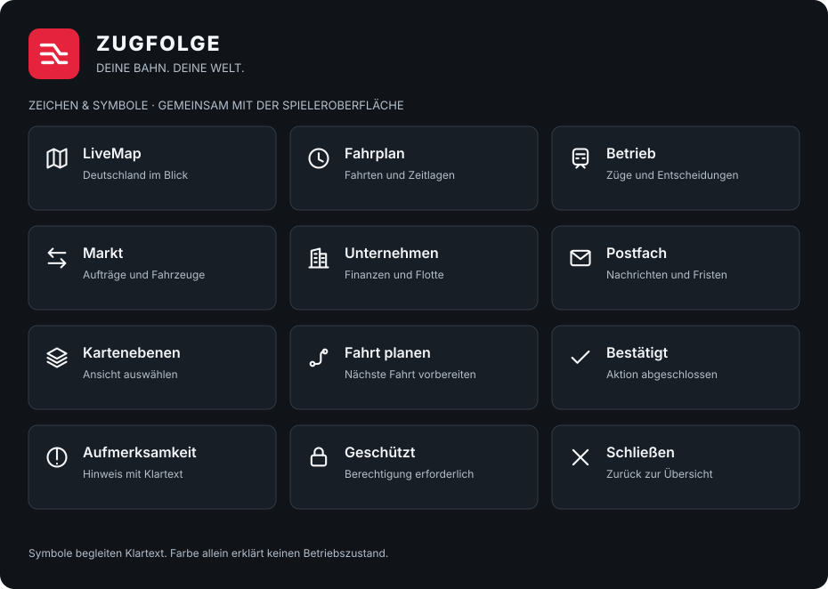

# Zugfolge: Gleiszeichen und Symbole

Die aktuelle Identität verwendet ein weißes Gleiszeichen auf rotem Grund,
den Schriftzug **ZUGFOLGE** und „Deine Bahn. Deine Welt.“. Sie gehört zur
deutschlandweiten Oberfläche aus [ADR-0035](../adr/0035-deutschlandweite-spieleroberflaeche.md).
Graphitflächen, Bahnrot und klare Wegeleitung vermitteln Bahnflair. Das Zeichen
ist eine eigene abstrahierte Gleisverzweigung und verwendet kein DB-Logo.



## Aktuelle Dateien und Verwendung

| Datei / Quelle | Verwendung |
| --- | --- |
| [Gleiszeichen als SVG](zugfolge-rail-mark.svg) | Eigenständiger Export für Dokumentation und Präsentationen |
| [Symbolübersicht als SVG](zugfolge-symbols.svg) | Beschriftete Übersicht der gemeinsamen UI-Symbole |
| [`railway.ts`](../../packages/design-system/src/railway.ts) | Verbindliche gerenderte Marke und Navigation der Anwendungen |
| [`index.ts`](../../packages/design-system/src/index.ts) | Gemeinsame SVG-Icons über `icon(name, label?)` |
| [`railway.css`](../../packages/design-system/src/railway.css) | Farb-, Schrift- und Größenwerte der aktuellen Oberfläche |

Die Dokumentationsgrafiken werden aus den tatsächlichen Renderfunktionen und
Farbtokens exportiert. Nach Änderungen am Design-System neu erzeugen:

```sh
pnpm --filter @zugfolge/design-system build
node tools/ui-preview/export-design-assets.mjs
```

Die Oberfläche bindet Marke und Icons über das Design-System ein. Kopierte
Einzelpfade in Anwendungen würden bei späteren Änderungen auseinanderlaufen.
Die Symbolübersicht zeigt vorhandene UI-Zeichen; sie ist kein Fahrzeug- oder
Schaffner-Assetkorpus. Dessen noch offene Abnahme bleibt M15.3.
Pflichtmotive, Originalbildherkunft, Raster und Freigabe werden getrennt im
[M15.3-Atlasvertrag](../art-atlas.md) geführt.

## Gestaltung und Zugänglichkeit

- Markenrot `#e5233d`, weiße Gleislinien, Graphithintergrund `#101419`.
- Schriftstapel: `Inter`, `Segoe UI`, Systemschrift. Der Text im SVG nutzt
  denselben Stapel; das Gleiszeichen selbst besteht ausschließlich aus Pfaden.
- Die Marke führt im Spiel zur LiveMap. Der sichtbare Schriftzug bleibt bei
  ausreichendem Platz erhalten; Mobilgrößen folgen dem gemeinsamen CSS.
- Navigationssymbole stehen neben einer Beschriftung. Rein dekorative Icons
  bleiben für Screenreader verborgen; alleinstehende Aktionen erhalten einen
  zugänglichen Namen.
- Betriebszustände haben eigene Text-/Minutenangaben. Markenrot ersetzt keine
  Zustandsauskunft. Die vollständige Palette steht in [Design](../design.md).

Die [Bildherkunft](../ui-redesign/images.md) dokumentiert die generierte
Einstiegsaufnahme und den separat gekennzeichneten KI-Entwurf. Die
[Galerie](../ui-redesign/README.md) zeigt echte Browserbilder mit Beispieldaten.
Die gesonderte Behandlung der Marke bleibt in [Rechteschutz](../rechteschutz.md)
beschrieben; diese Exporte ändern keine Lizenz.

## Frühere Entwürfe

Die Dateien `zugfolge-wordmark*`, `zugfolge-monogram*`, `zugfolge-favicon-v3*`
und `zugfolge-logo-concept*` bleiben als **historische Studien V1–V3** erhalten.
V1 war achromatisch, V2 verwendete Ultramarin, V3 ergänzte ein Netzmotiv.
Sie sind keine Vorgaben für neue Oberflächen. Die frühere Pflicht zur rein
typografischen, farblosen Marke und das Verbot von Bahnrot wurden mit
ADR-0035 aufgehoben.
