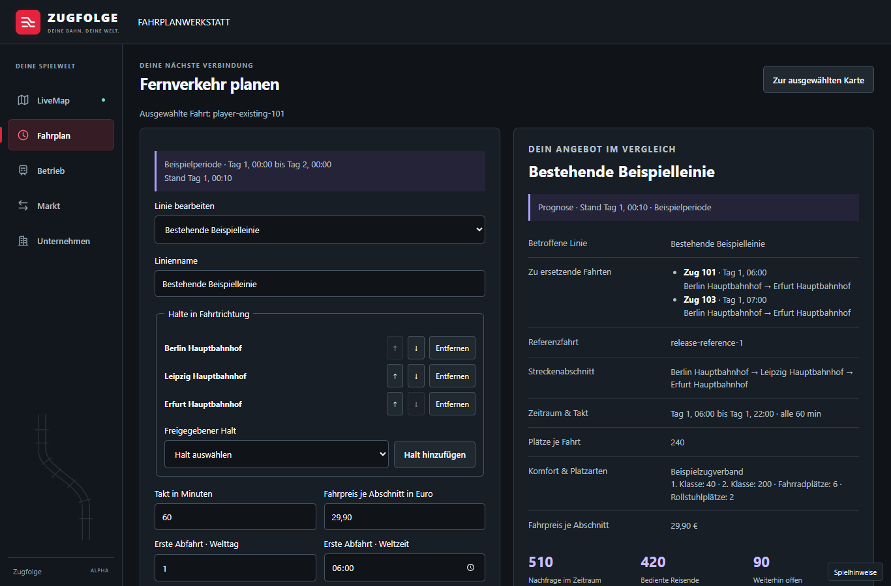

# M10 — Implementierung und Abnahmegrenzen

Stand: 06.09.2026. Gemeint ist **M10 — Personenverkehrsnachfrage und SPFV**,
GitHub-Milestone 11. Die technische Implementierung ist als PR-Stack auf der
Gestaltungsbasis #531 veröffentlicht. #530 wurde während der Arbeit in `main`
übernommen. Es werden keine Issues oder Milestones durch diesen Bericht
automatisch geschlossen.

Reihenfolge: [Gestaltungsbasis #531](https://github.com/larynxberlin-rgb/Zugfolge/pull/531)
→ [Nachfragekern #532](https://github.com/larynxberlin-rgb/Zugfolge/pull/532)
→ [Trassenplanung #533](https://github.com/larynxberlin-rgb/Zugfolge/pull/533)
→ [API, Oberfläche und Kalibrierung #534](https://github.com/larynxberlin-rgb/Zugfolge/pull/534).
Die drei M10-PRs bleiben bis zur fachlichen Abnahme Entwürfe.

Der ergänzende [Abgleich aller acht Issue-Anforderungen mit Code und Tests](m10-issue-verknuepfung.md)
unterscheidet die vollständig implementierten Fachumfänge #169–#172,
#361 und #379 von den konkreten offenen Anforderungen in #210 und #173. Schließende
Verknüpfungen werden am gesamten Stack über #534 geführt.

## Fachlicher Umfang

| Issue | Implementierung und reproduzierbarer Nachweis | Abnahmegrenze |
|---|---|---|
| #169 | `zugfolge-demand`: versionierte Zonen, Stationsanbindung, Profile, Saison, Tagesgang, deterministische Kohorten; Pilot-Golden und Poolingtests | Datenparameter bleiben sichtbar `balanced`, solange sie nicht beobachtet und belegt sind |
| #170 | Lexikographische Verkehrsmittel-/Verbindungs-/Zugwahl, Kapazitätsalternativen, Zugausfall, Anschlussverlust, Preis und Komfort; Permutations-/Replayszenarien | Nationale Laufzeit- und Abdeckungstests sind keine Folge des kleinen Pilotnachweises |
| #171 | Abschnittspreise, Vertriebsverfügbarkeit, Komfort-/Sonderplätze, durchgehende Reservierungen und Stehplätze; gemeinsame Kapazität über Generationfenster | Prognostizierte Erlöse lösen keine tatsächlichen Einnahmebuchungen aus |
| #210 | Deterministische SPNV-Manifeste, versteckte Fahrberechtigungen, stabile Schlüssel; tatsächliche Haltbelege frieren bereits gereiste Abschnitte, Sitze und gebuchte Preise ein | Signierte Zwischenhaltbindungen, native Ankunfts-/Abfahrtsbelege und persistenter Nachfrageconsumer fehlen. Native Fahrtabschlussbelege existieren bereits. Die API kennzeichnet ihre aktuellen Ansichten als Prognose/Annahme |
| #172 | Linien-/Halte-/Takt-/Preis-/Formationsvorschau; bestehende Flotten-/Zugnummernautorität; atomare Anträge und Batchkoordinierung; Ablaufgrenzen und sichere künftige Ersetzung; bestätigte Reservierungen fließen zurück in die Nachfrage | Aktivierung im Betriebsprogramm, Umlaufvollständigkeit und Ist-Erlöse brauchen die vorhandenen Betriebsproducer |
| #361, #379 | Nachfrageoverlay, gestufte Details, Planung und Rücknavigation; echte MapLibre-/PMTiles-Karte mit 5.400 synthetischen Stationen, 5.000 Zügen, dichtem Knoten, Live-Deltas, Kartenklick und Listenalternative bei 1366/390/320 px | UI-/UX-Abnahme im dokumentierten synthetischen Lastumfang erfüllt. Produktiver Deutschland-Release und externe Produktabnahme bleiben eigenständige Nachweise |
| #173 | Recherchierte freie Quellen, unveränderte Lizenz-/Hashbelege, echte AFZS-Trainings-/Holdout-Tage, nativer Vergleich und strenges Kalibrierungsgate | Eine bestandene gemeinsame SPNV-/SPFV-Abnahme wird nicht behauptet; SPFV- und Umstiegsholdouts fehlen |

## Betriebs- und Datenschutzgrenze

`ZUGFOLGE_DEMAND_DEPLOYMENT_PATH` und
`ZUGFOLGE_DEMAND_DEPLOYMENT_SHA256` aktivieren einen lokalen, bytegenau
gepinnten Korpus für die konfigurierte Welt und Infrastruktur. Ohne Korpus
antworten die fachlichen Routen mit Nichtverfügbarkeit; Nullwerte werden nicht
als leere Züge dargestellt. Es gibt keinen JavaScript-Ersatz für die native
Nachfrageberechnung und keinen automatisch aktivierten Beispielkorpus.

Alle Generationfenster einer Periode werden unter einem Release und Seed in
einem Kapazitätspool ausgewertet. Doppelte Fahrtkennungen müssen identische
Fakten besitzen. Ein Pool bleibt für die enthaltenen Reisen über das reine
Erzeugungsfenster hinaus verfügbar. Bereits im Korpus überlappende
Periodenreleases werden ohne gemeinsamen Übergangsbeleg zurückgewiesen.
Bestätigte SPFV-Fahrten und aktuelle Verspätungen verlängern dagegen den
wirksamen Horizont der laufenden Periode: Der bisherige Pool bleibt bis zum
letzten Fahrtende lesbar, der nächste wird bis dahin zurückgestellt. Der
gespeicherte Checkpoint erhält diese Zuordnung über Neustarts. Ohne vorherigen
Checkpoint werden höchstens 256 begonnene Pools mit ihren jeweils begrenzten
Planungsprojektionen geprüft; dies ersetzt keinen Deutschlandlastnachweis.

Der Scheduler aktualisiert die Prognose höchstens alle 30 Sekunden nach einem
bestätigten Betriebsschritt. Unveränderte Eingaben erzeugen auch nach Neustart
keinen weiteren Checkpoint. Ausfall-/Verspätungsfakten werden beim Entfernen
eines Zuges aus dem Kartensnapshot nicht auf den ursprünglichen Fahrplan
zurückgesetzt. Die statische Fahrplanbindung nutzt exakte indizierte Halteabfragen;
die auf 160 Einträge begrenzte Stationsanzeige dient nicht als Datenautorität.

`demand.evaluated`, `spfv.preview`, `spfv.submitted` und `spfv.confirm` benutzen
das vorhandene Weltjournal beziehungsweise die Kommandoqueue. Weltmutex,
Archivfence, monotone Revision, Freigabepin, Inhaltskonflikt und natives Replay
werden geprüft. Neue Datenbanktabellen oder konkurrierende Migrationsnummern
werden nicht benötigt. Öffentlicher Ingest kann diese Fachbelege nicht erzeugen.

Öffentliche Abfragen liefern Aggregate. Die separate Manifestansicht prüft
aktiven Weltzugang und Unternehmenseigentum bei jeder Anfrage und paginiert
höchstens 50 synthetische Fahrgastkennungen. `fareFact`, Herkunft der
Fahrberechtigung, Seeds und vollständige Reise-/Sitzplatzjournale bleiben privat.
Auch Datenbankfehler werden ohne Queryparameter oder rohe Exceptiondetails
protokolliert. Diese Kennungen sind keine Identitäten realer Menschen.

## Reproduzieren

```sh
pnpm install --frozen-lockfile
pnpm build
pnpm typecheck
pnpm test
pnpm guards
pnpm licenses list --json | node tools/guards/dist/licenses-cli.js
cargo test --locked -p zugfolge-demand -p zugfolge-conflict -p zugfolge-planner -p zugfolge-planning-runtime
python -m unittest discover -s tools/demand-calibration -p 'test_*.py'
node .github/scripts/sync-milestones.mjs check
```

Der reguläre Linux-NAPI-Job führt `demand-service.test.ts` mit dem echten
Addon aus; `spfv-native.integration.test.ts` verbindet zusätzlich echte Flotte,
HTTP, Trassenkonkurrenz und Nachfrage-Restore. `demand-browser.e2e.test.ts`
und `demand-map-browser.e2e.test.ts` laufen mit den gebauten Browserclients.
Lokal wurde zusätzlich der echte Rust-JSON-CLI mit PGlite und API-Projektion
komponiert (`ZUGFOLGE_DEMAND_TEST_BINARY`); das ist ein Testtransport und kein
Produktionsfallback. Native Planung prüft bestehende Trassen, tägliche
Verkehrstage, absolute Gültigkeit, Zwischenhalte und atomare Ersetzungen.

Browsernachweise verwenden explizite Beispieldaten bei Breiten von 1920,
1366, 768, 390 und 320 Pixeln. Sie prüfen auch verlorene Bestätigungsantworten
und verspätete Vorschauergebnisse. Sie ersetzen keine produktiven Fahrgastdaten.
Die drei zusätzlichen [MapLibre-Lastfälle](m10-kartenabnahme.md) prüfen eine
synthetische Deutschlandkarte und einen dichten Knoten mit tatsächlich
gerenderten Tiles, Kartenklicks, Live-Deltas und kollisionsfreier Legende.
Zusammen sind acht M10-Browserfälle vorhanden.



Die schmalen Ansichten sind als [Fernverkehr auf Mobilgeräten](screenshots/m10/spfv-mobile.png)
und [Nachfrageliste auf Mobilgeräten](screenshots/m10/demand-mobile.png) dokumentiert.

Lokal nachgewiesen: 835 Rust-Workspace-Tests im Basislauf (ohne die beiden
Linux-NAPI-Crates) sowie drei ergänzte Issue-Akzeptanztests. Die
Nachfrageprüfung umfasst damit 17 Kerntests einschließlich Golden und
Properties; hinzu kommen 13 native
Planning-Runtime-Tests sowie die fokussierten API-, Privacy-, Planner- und
Browsernachweise sowie fünf Python-Tests zu freien Originalquellen,
Trainings-/Holdout-Trennung und bytegenauen JSON-Pins. Clippy, Typprüfung und 15 Repositorywächter sind Bestandteil
der Prüfung. Der vollständige Windows-TypeScript-Lauf wurde wegen Zeitlimits
in unveränderten PGlite-Bestandstests unter paralleler Compilerlast abgebrochen;
er wird nicht als grün ausgegeben. Der Linux-CI-Lauf bleibt maßgeblich.

Die echten Quelldaten und den wiederholbaren nativen Vergleich beschreibt
[tools/demand-calibration](../tools/demand-calibration/README.md).
Die vollständige Quellen-/Lizenzentscheidung und ausgeschlossene Datensätze
stehen in [M10-Kalibrierungsquellen](m10-kalibrierungsquellen.md).

## Berücksichtigte offene Abhängigkeiten

Der [Issue-/PR-Audit](m10-issue-audit.md) enthält den gesichteten Gesamtbestand
und die fachliche Zuordnung. Besonders relevant bleiben #517/#518
(Betriebsprogramm und Abschluss-/Abrechnungsanbindung), #509/#393/#398 (Skalierung), #350
(Zugnummernautorität), #419 (dauerhafte Kommandowiederholung), #504
(belegte Kapazitätszusagen), #502/#520 (Datenschutz) sowie die unabhängige
M9-/Deutschland-/Produktionsabnahme. M15 erhält ausschließlich den M10-Vertrag;
der Schaffnermodus erzeugt keine zweite Nachfrage oder Fahrberechtigung.

Die Implementierung ermöglicht überprüfbare technische Reviews. Die gesamte
M10-Abnahme bleibt offen, bis gemessene SPFV-/Umstiegsholdouts, passende
Toleranznachweise und produktive Betriebs-/Last-/Spielerbelege vorliegen.
