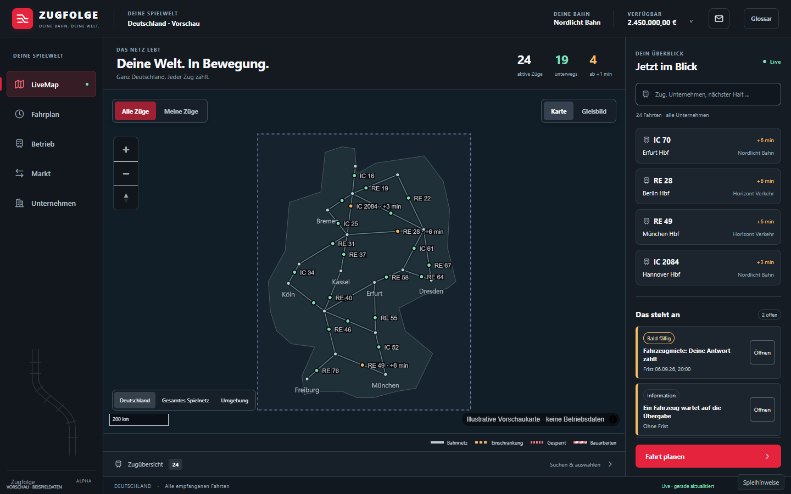
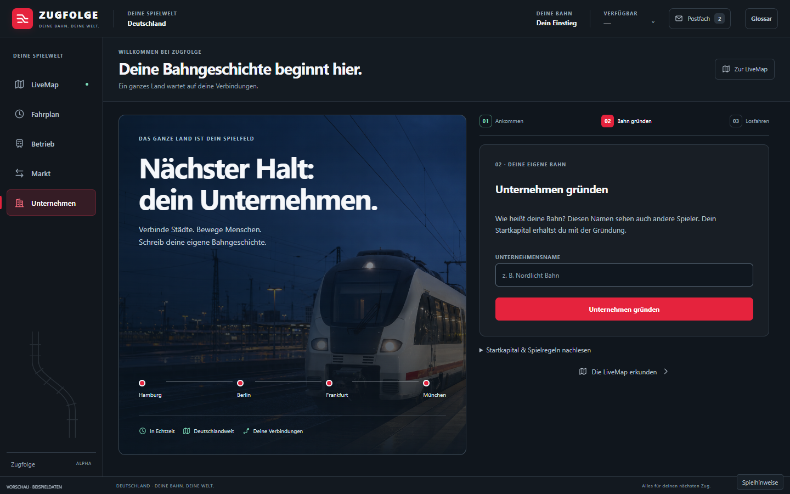

# Zugfolge: neue Spieleroberfläche

Umsetzung auf Grundlage von PR #530. Die LiveMap wird zur deutschlandweiten
Spielübersicht. Eine gemeinsame dunkle Oberfläche mit eigener roter Gleismarke
verbindet Karte, Fahrplan, Betrieb, Markt und Unternehmen.

Zur Weiterarbeit gehören [Design und Spielertexte](../design.md),
[Navigation und Spielerwege](../ux-spieler-shell.md),
[Zeichen und Symbole](../brand/README.md) sowie die
[zugeordneten GitHub-Abnahmen](issue-abgleich.md).

## LiveMap



Die Karte startet mit ganz Deutschland. Zugfilter, Suche und eine ausklappbare
Zugübersicht ergänzen die geografische Auswahl. Auffällige Fahrten stehen im
Infobereich zuerst. Zugdetails öffnen sich direkt über der Karte. Die Zahlen
kommen aus dem jeweils empfangenen Stream und berücksichtigen den aktiven Filter.

## Unternehmen gründen



Der Einstieg führt über Spielername und Spielregeln zur eigenen Bahn.
„Weltvertrag“ heißt in der Oberfläche „Dein Einstieg“; die eigentliche
Gründung heißt „Unternehmen gründen“. Startkapital und Bedingungen bleiben
zugänglich. Die bestehenden Bestätigungen für verbindliche Entscheidungen
bleiben erhalten.

## Weitere Ansichten

| Ansicht | Bildschirmfoto |
| --- | --- |
| Spiel starten | [Einstieg](screenshots/entry.png) |
| Zug auswählen | [Zugdetails](screenshots/train-details.png) |
| Unternehmen und Finanzen | [Unternehmen](screenshots/company.png) |
| Eigene Fahrzeuge | [Flotte](screenshots/fleet.png) |
| Verkehrsaufträge | [Aufträge](screenshots/markets.png) |
| Fahrzeuge kaufen oder mieten | [Fahrzeugmarkt](screenshots/vehicles.png) |
| Verträge zwischen Unternehmen | [Zusammenarbeit](screenshots/cooperation.png) |
| Fahrt, Leerfahrt und Werkstatt | [Fahrten planen](screenshots/workshop.png) |
| Nachrichten und Fristen | [Postfach](screenshots/mailbox.png) |
| Betriebsentscheidungen | [Betriebszentrale](screenshots/operations.png) |
| Regeln für den Betrieb | [Automatik](screenshots/program.png) |
| Tagesberichte | [Berichte](screenshots/reports.png) |
| Zeitliche Planung | [Bildfahrplan](screenshots/planner.png) |
| Mobile LiveMap | [Karte auf dem Handy](screenshots/map-mobile.png) |
| Mobiles Unternehmen | [Unternehmen auf dem Handy](screenshots/company-mobile.png) |
| Mobiler Markt | [Markt auf dem Handy](screenshots/markets-mobile.png) |
| Mobiler Betrieb | [Betrieb auf dem Handy](screenshots/operations-mobile.png) |
| Mobiler Fahrplan | [Fahrplan auf dem Handy](screenshots/planner-mobile.png) |

**Diese Screenshots zeigen die implementierten Oberflächen mit gekennzeichneten
Beispieldaten.** Die Vorschaukarte ist ein vereinfachtes Schema Deutschlands;
Korridore und Züge sind illustrative Testdaten. Im Spiel bleibt die vorhandene
selbst gehostete Karte mit ihren bestätigten Zugpositionen maßgeblich.
Der Bildfahrplan zeigt einen einzelnen Beispielabschnitt innerhalb Deutschlands.

Der [KI-Designentwurf](design-concept-deutschland.png) ist eine Konzeptgrafik.
Er ist separat von den Browser-Screenshots abgelegt und behauptet keine
bereits vorhandenen Spielkennzahlen oder zusätzlichen Backend-Funktionen.

## Lokal ansehen und prüfen

Nach `pnpm install --frozen-lockfile` zunächst die beteiligten Anwendungen
einschließlich ihrer Abhängigkeiten bauen:

```sh
pnpm --filter @zugfolge/game-web... --filter @zugfolge/livemap... --filter @zugfolge/operations-center... build
node tools/ui-preview/server.mjs
```

Anschließend `http://127.0.0.1:4173/?screen=map` öffnen. Weitere Startansichten
lassen sich mit `screen=foundation`, `company`, `markets`, `workshop`, `mailbox`,
`operations`, `program`, `reports` oder `planner` aufrufen. Die Vorschau schreibt
keine produktiven Spielzustände. Ihre Daten werden nicht von den
Produktionsanwendungen importiert.

In einem zweiten Terminal:

```sh
node tools/ui-preview/check.mjs
pnpm --no-bail --filter @zugfolge/design-system --filter @zugfolge/game-web --filter @zugfolge/livemap --filter @zugfolge/operations-center test
```

Der Browsercheck verwendet unter Windows das installierte Edge. Auf anderen
Systemen kann `PLAYWRIGHT_CHROMIUM_EXECUTABLE_PATH` auf Chromium zeigen.
`UI_PREVIEW_PORT` und `UI_PREVIEW_ORIGIN` erlauben einen anderen lokalen Port.

Der Nachweis umfasst 34 Layouts bei 1440×900, 1366×768, 1024×768, 390×844 und
320×844 Pixeln, Register per Tastatur und Fragmentlink, Eingaben beim
Registerwechsel, geöffnete Formulare beim Aktualisieren, eigene Züge,
Zugsuche, Detailansicht sowie eingeblendete Spielhinweise auf 320 Pixeln. Das maschinenlesbare Ergebnis steht in
[screenshots/qa.json](screenshots/qa.json). Die 207 Tests der vier beteiligten
Pakete und drei bestehende Tooltip-Browsertests im gebauten Spiel ergänzen
diesen UI-Nachweis. Ein vollständiger Produktions-, Last- oder Anmeldetest ist
damit nicht verbunden.

## Inspiration und Gestaltung

AirlineSim diente als Inspiration für den Wechsel zwischen Unternehmensüberblick,
Fahrzeugen und operativen Entscheidungen. Verwendet wurden die offiziellen
Beschreibungen des [Unternehmensüberblicks](https://handbook.airlinesim.aero/en/docs/user-interface/company-overview/)
und des [Betriebsbereichs](https://handbook.airlinesim.aero/en/docs/user-interface/operations-tab/).
Layout, Zeichen, Farben und Texte wurden eigenständig für Zugfolge aufgebaut.
Die [Bildherkunft](images.md) dokumentiert die generierte Zugaufnahme.
