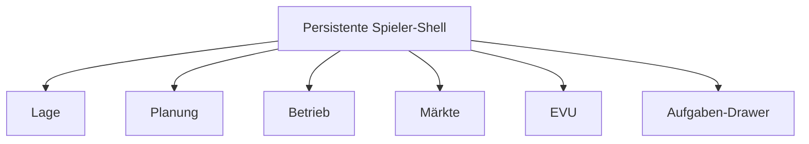

# UX-Zielbild: Spieler-Shell und Arbeitsräume

**Stand:** 16. August 2026  
**Bezug:** [Produkt](produkt.md) · [Design](design.md) · [Milestones](milestones.md) · [Roadmap-Status](roadmap-status.md)

Dieses Dokument übersetzt den belegten Produktstand und die offenen Milestones
in eine dauerhaft tragfähige Informationsarchitektur. Es ersetzt weder die
fachlichen Verträge noch die Milestone-Abnahme.

## 1. Ausgangslage

Die fachliche Tiefe ist der sichtbaren Spieleroberfläche voraus. Bis M7 sind
Infrastruktur, Welt/EVU/Ledger, Trassenplanung, Simulation/Live-Lage,
Fahrzeuge/Personal, SPNV-Wirtschaft und Betriebszentrale abgenommen. M8 besitzt
ebenfalls für alle zwölf Teilpunkte einen reproduzierbaren Beleg; das
GitHub-Milestone bleibt ausschließlich wegen des blockierten Betriebs-Gates
offen. M9 ist der gegenwärtige Alpha-Schnitt.

| Stand | Milestones | UX-Konsequenz |
|---|---|---|
| geschlossen | M0–M7 | Diese Funktionen sind reale Arbeitsbereiche, keine Zukunftsattrappen. |
| fachlich vollständig, formal offen | M8 | Störungen, Baustellen, Ersatzkonzepte und Vertragsfolgen gehören in den Betrieb; der Rest ist Betriebsfreigabe. |
| in Arbeit/blockiert | M9 | Tutorial, Onboarding, Schutz, Telemetrie, Weltende und Infrastrukturupdate brauchen klare Systemzustände. |
| offen | M10 | Nachfrage, Zugwahl, Tarife, Kapazität, Manifeste und SPFV-Linienplanung. |
| offen | M11 | Güterströme, Wagen, Verladerverträge, Wagenumläufe und Gefahrgut. |
| teilweise vorgezogen | M12 | EVU-Verträge und Fahrzeugmarkt existieren; Vermieter, Bietergemeinschaften und Rankings folgen. |
| teilweise begonnen | M13 | Odoo/Bridge/Entitlements begonnen; Mehrfensterplanung, Vorlagen, Sammelbearbeitung, Exporte und Archiv folgen. |
| teilweise begonnen | M14 | Mitteldeutschland erledigt; Deutschland-Infrastruktur, Signatur, Lastverteilung und Migration folgen. |
| Spezifikation begonnen | M15 | Schaffnermodus folgt kontextuell aus einem eigenen aktiven Zug. |

Der bisherige Bruch liegt in der Präsentation:

- `game-web` stapelt Weltvertrag, Postfach, Onboarding, Ausschreibungen,
  Fahrten, Werkstatt, Verträge und Fahrzeugmarkt zu einer langen Seite.
- Live-Lage, Spielerreise und Betriebszentrale verwenden unterschiedliche
  Shells und Bezeichnungen.
- Die fertige Betriebszentrale ist aus der Hauptnavigation kaum erreichbar.
- EVU und Liquidität fehlen im globalen Kontext, obwohl Ledger und
  Wirtschaft bereits existieren.
- Formulare zum Erstellen sind ständig sichtbar, auch wenn der Spieler nur
  Bestände vergleichen möchte.

## 2. Leitentscheidung

„Auf eine Seite passen“ bedeutet eine **viewportfüllende Anwendung**, nicht
eine Mammutseite. Auf Desktop scrollt das Dokument nicht. Nur ausdrücklich
erkennbare Tabellen, Listen, Dokumente und Inspector-Panels scrollen lokal.

Die Live-Lage bleibt die Startseite und das räumliche Zentrum. Jede weitere
Aufgabe öffnet einen Arbeitsraum innerhalb derselben Shell.



## 3. Persistente Shell

Die obere Leiste enthält immer:

1. Welt und Weltstatus,
2. aktives EVU beziehungsweise die Aktion „EVU gründen“,
3. **Verfügbar** als autoritative Liquidität,
4. offene Aufgaben mit Anzahl,
5. Weltzeit/Verbindungsstand dort, wo er betrieblich nötig ist.

Die Desktop-Navigation besitzt höchstens fünf Primärziele:

| Primärziel | Heutiger Inhalt | Kommende Erweiterung |
|---|---|---|
| Lage | Live-Karte, Zug-/Stationsdetail, Störungen | Deutschlandkarte, Nachfrage-/Auslastungslayer, Archiv und Replay |
| Planung | Trassen, Bildfahrplan, Konflikte, Ad-hoc-Fahrten | SPFV-Linien, Takte, Mehrfenster, Vorlagen, Sammelbearbeitung, Export |
| Betrieb | laufende Fahrten, Disposition, Betriebsprogramme, Berichte | Fahrgastmanifeste; Schaffnermodus aus dem eigenen Zugdetail |
| Märkte | SPNV-Ausschreibungen, Fahrzeugmarkt, EVU-Verträge | Personen-/Gütermarkt, Verlader, Vermieter, Bietergemeinschaften |
| EVU | Flotte, Personal, Liquidität, Ledger, Verträge | Wagen, Rankings/Bonität, Kredite, Schlusswertung, Archiv, Entitlements |

Postfach und Fristen sind kein gleichgewichtiger Fachbereich. Sie liegen als
globaler Aufgabenknopf in der Kopfzeile; die vollständige Liste bleibt als
eigene fokussierte Ansicht erreichbar. Weltvertrag, Tutorial und EVU-Gründung
sind Einstiegszustände und verschwinden nach Abschluss aus dem täglichen
Arbeitsfluss.

Neue Milestone-Funktionen erscheinen erst, wenn die konkrete Welt sie
unterstützt. Es gibt keine Reihe ausgegrauter M10–M15-Attrappen.

## 4. Arbeitsraummuster

Jeder Arbeitsraum verwendet dasselbe Raster:

- lokale Titelleiste mit Untertabs, Suche, Filtern und höchstens einer
  primären Aktion;
- zentrale Tabelle, Karte, Zeit-Weg-Darstellung oder Liste;
- optionaler Inspector mit 340–420 px Breite;
- verbindliche Aktion am festen Fuß des Inspectors;
- technische IDs nur unter „Technische Details“.

Wiederholte Objekte werden als kompakte Tabellenzeilen dargestellt. Auswahl
öffnet den Inspector und bleibt in der URL, damit Reload, Zurück und Deep Links
funktionieren. Erstellen/Bearbeiten wird erst auf ausdrückliche Aktion als
Drawer oder Formularpanel geöffnet.

Verbindliche Entscheidungen folgen durchgängig:

`Entwurf → serverseitig prüfen → Wirkung zeigen → bestätigen → ausstehend → verbucht`

Routineerfolg erscheint als kompakter Status. Dialoge bleiben irreversiblen,
vertraglichen oder hochriskanten Aktionen vorbehalten.

### Lage als lebendige Welt

Die Karte bleibt auch dann die Hauptfläche, wenn eine Tabelle einzelne
Managementaufgaben effizienter lösen könnte. Ihr Primärnutzen ist
Weltpräsenz: bewegte Züge anderer EVU, gemeinsame Weltzeit, Störungen und
Belegungen zeigen, dass der Betrieb ohne den Spieler weiterläuft. Deshalb
bleibt Lage der Einstieg und bewahrt Kartenausschnitt, Zeitcursor und Auswahl
beim Wechsel zwischen Zug, Bahnhof und Inspector.

Die OSM-Basiskarte liefert nur den geografischen, atmosphärischen Zusammenhang.
Sie ist keine fachliche Interaktionsquelle und kann als statisches, stark
gecachtes PMTiles-Artefakt progressiv nachladen. Züge, Störungen und Details
bleiben davon getrennt serverautoritativ. Der zusätzliche Payload ist bewusst
akzeptiert, weil dieser Kontext Zugehörigkeit und Lageverständnis erzeugt.

Das tägliche Spielerprofil ist kein Infrastruktur-Editor:

| Kartenobjekt | sichtbare Hauptinformation | Auswahlfolge |
|---|---|---|
| Zug | EVU, Zugnummer, Soll/Ist, Betriebsstatus | Betriebssicht und FIS |
| gruppierter Bahnhof | Name, RIL 100, aktuelle Abweichung | Grunddaten, Fallblattanzeige, belegte Statistik |
| Werkstatt | Name, Leistungen, Zugang/Verfügbarkeit | Werkstattauskunft; erst mit eigenem autoritativem Readmodel |
| A-/B-Strecke | VzG-Streckennummer/-kurzname, Vzul | kurze Streckenauskunft; Elektrifizierung und Gleiszahl ergänzend |
| A-/B-Signal | neutrales Signalicon | keine technische Auswahl ohne verständliche autoritative Auskunft |

Freigegebene Spielerartefakte enthalten nur A/B. Bahnsteigpunkte, Weichen,
technische Betriebsstellen, Blöcke, Konfliktressourcen, Anlagen und
`rail_context` bleiben unabhängig von ihrer A-/B-Qualität im Default verborgen.
Ungelöste Pflichtbefunde gelangen nicht bis in die Shell, weil sie bereits den
Releasekandidaten blockieren.
Der Bahnhof bündelt seine Bahnsteige; der konkrete Bahnsteig erscheint in der
Tafelzeile. Technische ID, Release, Qualität und Modellzustand liegen
geschlossen unter „Technische Details“. Der heutige Release hat keine
belastbare KBS-Bezeichnung; VzG-Werte werden nicht falsch als KBS beschriftet.
Eine KBS-Zeile folgt erst nach autoritativer, versionierter Zuordnung.

Der Bahnhofs-Inspector passt ohne Dokumentscroll in den Viewport: feste
Grunddaten oben, Tafel und Statistik als lokale Tabs, jeweils mit eigenem
Scrollbereich. V1 zeigt Name, RIL 100, EVA/UIC, Betriebsstellenart und das
aktuelle Fahrplanfenster. Ein späteres `StationSummaryReadModel` liefert für
einen klar genannten Zeitraum Fahrgastaufkommen, Zugzahl, Pünktlichkeit und
EVU-Anteile. Fehlende Langzeitwerte werden nicht aus den aktuellen Fahrten
geschätzt.

Künftige Nachfrage-, Auslastungs-, Güter-, Baustellen- und Replaydaten werden
als einzeln aktivierbare Lageebenen ergänzt, nicht als weitere dauerhafte
Punktwolken. Ein Layer muss eine konkrete Frage beantworten; nach Verlassen
des zugehörigen Arbeitsflusses kehrt die Karte zum ruhigen Spielerprofil
zurück. Bahngefühl entsteht über präzise Sprache, Weltzeit, Bewegung,
Statuswechsel, Tafel und FIS — nicht über Dekoration.

## 5. EVU-Liquidität

Der sichtbare Headerwert heißt **Verfügbar**. Er ist nicht die Summe aller
Ledger-Konten – eine doppelte Buchführung würde dort null ergeben – und nicht
nur das ursprüngliche Startkapital.

Der versionierte Read-Vertrag lautet:

```ts
type OperatorFinanceSummaryV1 =
  | {
      mode: "finite";
      ledgerBalanceCents: string;
      pendingDebitCents: string;
      availableCents: string;
    }
  | { mode: "unlimited" };

interface PlayerOperatorContextV1 {
  schemaVersion: "zugfolge-operator-context/v1";
  worldId: string;
  operators: readonly {
    id: string;
    name: string;
    finance: OperatorFinanceSummaryV1;
  }[];
}
```

Regeln:

- `availableCents = ledgerBalanceCents − pendingDebitCents` wird
  serverautoritativ gebildet.
- `unlimited` erscheint ausgeschrieben als **Unbegrenzt**, nie als `0 €`.
- Während des Ladens steht `—`; ein Fehler darf keinen Nullsaldo vortäuschen.
- Positive Werte bleiben achromatisch. Warnfarbe setzt einen konkreten
  Risikozustand voraus und wird immer durch Symbol plus Text ergänzt.
- Beträge verwenden Tabellenziffern; Mobile darf den Headerwert visuell
  kürzen, muss den exakten Wert im Detail zeigen.
- Der EVU-Wechsel ist an Welt und URL gebunden und aktualisiert Header und
  Inhalt atomar.

Das Finanzdetail zeigt zunächst Kontostand, vorgemerkte Belastungen und
verfügbaren Betrag. Später folgen Periodenergebnis, nächste große Fälligkeit,
Kredite und Insolvenzstufe additiv.

## 6. Zustände und Barrierefreiheit

Die Shell bleibt bei Laden, Leerstand, Fehler und Offline-Zustand sichtbar.

| Zustand | Verhalten |
|---|---|
| Laden | Skelett nur im betroffenen Arbeitsraum; Finanzwert `—` |
| kein EVU | klare Aktion „EVU gründen“, kein erfundener Betrag |
| leer | Grund und genau eine sinnvolle nächste Aktion |
| keine Berechtigung | lesbarer Grund statt verschwundener Funktion |
| veraltet/offline | Datenstand sichtbar; verbindliche Aktionen read-only |
| Revisionskonflikt | Serverfassung und eigener Entwurf vergleichbar zeigen |
| archivierte Welt | durchgehend read-only; Schlusswerte und Replay zugänglich |

Mindestzielgröße ist 44 px. Zustand wird nie nur durch Farbe vermittelt. Drawer
und Dialoge besitzen Fokusführung und Rückkehrfokus. Komplexe Planung bleibt
desktop-first.

## 7. Responsive Verhalten

- ab etwa 1280 px: Navigation und Inspector angedockt;
- 900–1279 px: kompakte Navigation, Inspector als Overlay;
- unter 900 px: feste Bottom-Navigation mit Lage, Planung, Betrieb, Märkte und
  EVU; Details als Bottom Sheet;
- Smartphone/PWA: Lage, Meldungen, Freigaben und begrenzte Disposition;
  komplexe Regel- und Mehrfensterplanung bietet lesenden Zustand und
  „Am Desktop fortsetzen“.

Safe Areas und `100dvh` verhindern, dass Navigation oder Aktionsleiste Inhalte
überdecken.

## 8. AirlineSim als Referenz

Die seit Juni 2026 getestete AirlineSim-Gen-3-Shell bestätigt zwei Muster:
ausgewähltes Unternehmen plus Cash bleiben global sichtbar, und die Navigation
gruppiert Aufgaben statt Einzelfunktionen. Dichte Flottenlisten und
Wochenraster zeigen außerdem den Wert von Tabellen, Sticky-Achsen, Filtern und
Mehrfachaktionen.

Übernommen werden globaler EVU-/Cash-Kontext, aufgabenbasierte Navigation,
Bottom-Navigation, lokale Suche und dichte Arbeitsraster. Nicht übernommen
werden die winzige Legacy-Typografie, niedriger Kontrast, tiefe Menüs,
Grün/Rot als alleinige Bedeutung, dekorative Farbverläufe oder beliebig
konfigurierbare Dashboard-Kacheln.

Für das Bahnhofsdetail wird außerdem das Prinzip „stabile Objektidentität →
wenige Kennzahlen → lokale operative Tabelle“ übertragen: RIL 100 und
Grunddaten bleiben stehen, während Tafel und belegte Statistik in lokalen Tabs
wechseln. Das ist eine Interaktionsstruktur, kein visuelles Markenzitat.

Quellen: [Gen-3-Vorschau](https://forums.airlinesim.aero/t/feature-preview-gen-3-ui/27706) ·
[Glow-Up-Ziele](https://forums.airlinesim.aero/t/project-glow-up-ui-refresh/26292) ·
[Company Dashboard](https://handbook.airlinesim.aero/en/docs/user-interface/company-overview/) ·
[Planung](https://handbook.airlinesim.aero/en/docs/user-interface/commercial-tab/) ·
[Finanzen](https://handbook.airlinesim.aero/en/docs/user-interface/management-tab/) ·
[Technology-Demonstrator-Studie](https://phenomenonstudio.com/projects/airlinesim-realistic-online-airline-management-simulation/)

## 9. Umsetzung und Abnahme

### P0 – vor externer M9-Alpha

1. gemeinsame Shell-Navigation und ein versionierter Welt-/EVU-Kontext,
2. permanente Anzeige der verfügbaren Liquidität,
3. lange Spielerreise in echte Arbeitsräume zerlegen,
4. Betriebszentrale auf aktive Tabs statt vertikale Ankerseite umstellen,
5. Aufgaben-Deep-Links direkt zum Fachobjekt führen.

### P1

1. Kartenprofil, gruppierte Bahnhofsauskunft und Objekt-Inspector umsetzen,
2. Erstellen/Bearbeiten in Drawer verschieben,
3. gemeinsame Shell-Komponenten ins Designsystem heben,
4. operations-center aus der Hauptnavigation erreichbar machen,
5. Fokus, Entwürfe und Operator-Kontext über Appwechsel erhalten.

### P2

1. gespeicherte Planungsarbeitsplätze und Mehrfenster,
2. Sammelbearbeitung, Vorlagen und Exporte,
3. feature-gesteuerte Untertabs für M10–M15.

Abnahmegrößen: 1440×900, 1024×768 und 390×844. In jedem täglichen
Arbeitsraum gilt `document.scrollHeight === document.clientHeight`; nur mit
`data-scroll-region` markierte Bereiche dürfen scrollen. Zusätzlich werden
Tastaturreihenfolge, Drawer-Fokus, Deep Links sowie finite Null, negative
Liquidität, vorgemerkte Belastungen und `unlimited` getestet.
