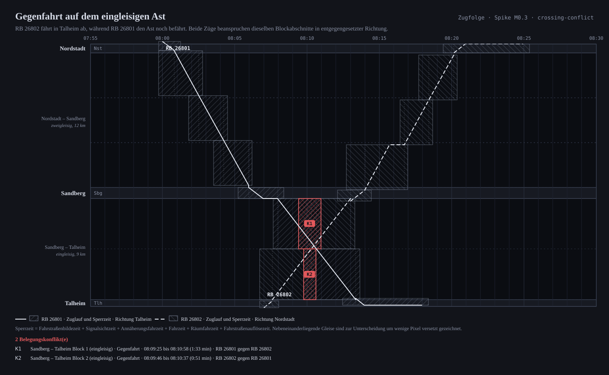
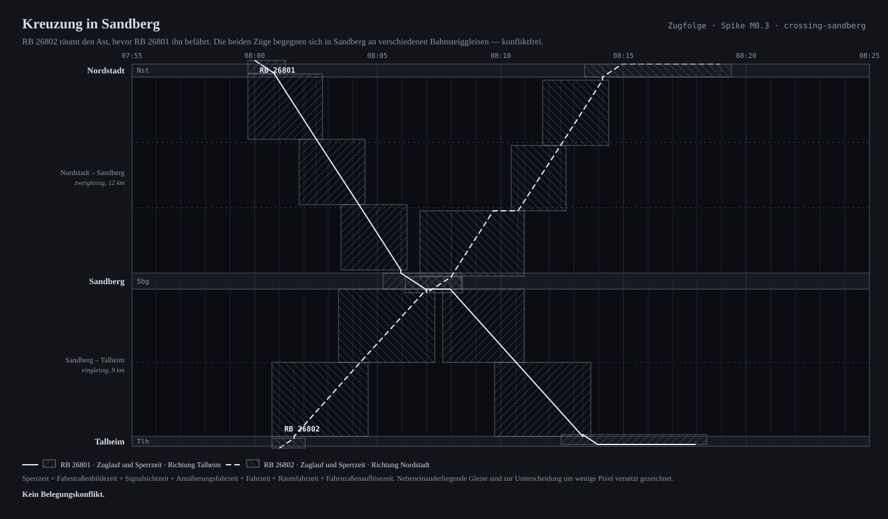
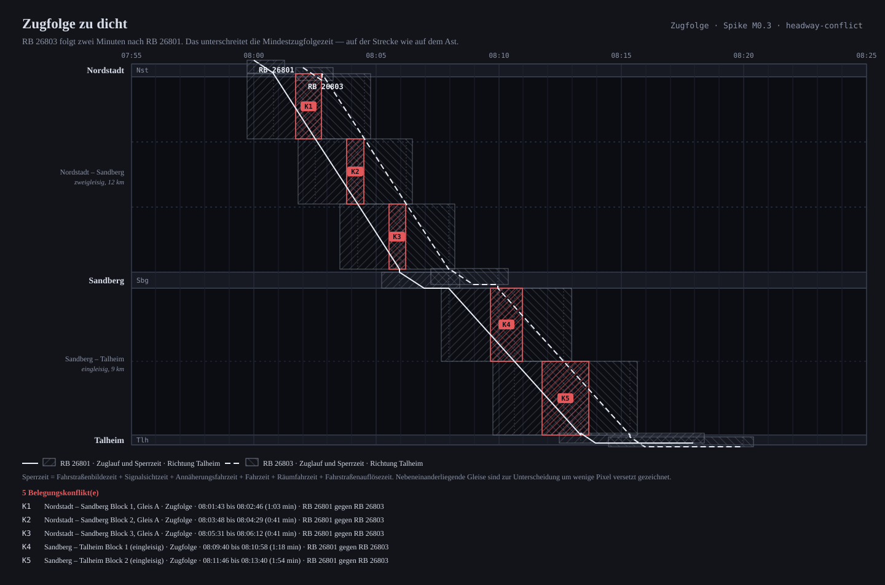
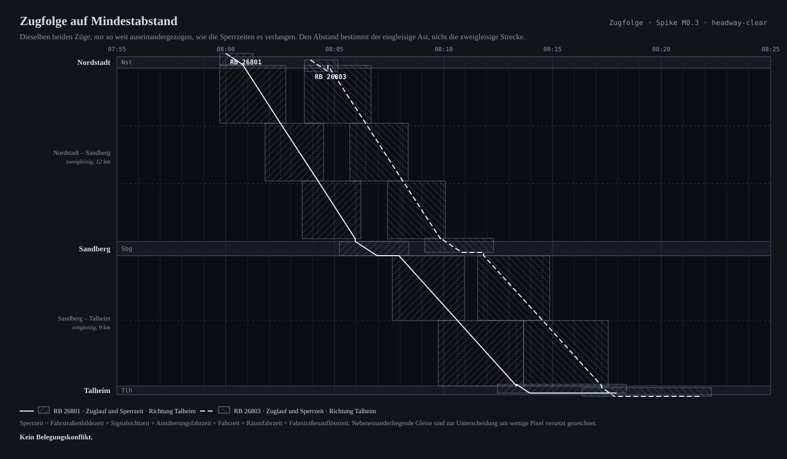

# Wegwerf-Spike M0.3 — Sperrzeitentreppe

> **Verfällt mit M3.1.** Dieser Code ist zum Wegwerfen gebaut. Sobald das echte
> Sperrzeitenmodell steht, wird `spikes/blocking-time-staircase/` gelöscht —
> nicht weitergepflegt. Nichts außerhalb von `spikes/` darf ihn verwenden.

## Die Frage

M0.3 hat genau einen Zweck: **Trägt die Konfliktprüfung über Sperrzeiten?**
Sie ist die Existenzberechtigung des Projekts — Trassenvergabe, Planner,
Simulation und Baustellenverfahren hängen alle daran. Der billigste Zeitpunkt,
das zu prüfen, ist jetzt, mit drei Betriebsstellen und zwei Zügen.

Der Aufbau folgt `docs/milestones.md` M0.3 wörtlich: drei Betriebsstellen, eine
zweigleisige Strecke plus eingleisiger Ast, zwei Züge, Konfliktprüfung,
Bildfahrplan als Bild.

## Die Antwort

**Ja — mit drei benannten Lücken.** Ausführlich in [Ergebnis](#ergebnis).

---

## Der Aufbau

```text
Nordstadt ═══════ zweigleisig, 12 km ═══════ Sandberg ─── eingleisig, 9 km ─── Talheim
 Gleis 1/2/3      Gleis A (Ri. Talheim), 3 Blöcke   Gleis 1/2/3   2 Blöcke      Gleis 1/2
                  Gleis B (Ri. Nordstadt), 3 Blöcke
```

Die Namen sind **erfunden**. Das Rechte-Gate (M0.4) ist offen, also arbeitet der
Spike bewusst nicht mit realer Infrastruktur. Die Größenordnungen sind es
dagegen: 4 km Blocklänge auf der Strecke, 4,5 km auf dem Ast, 1000 m
Vorsignalabstand, 200 m Durchrutschweg, 12 s Fahrstraßenbildezeit, 5 s
Signalsichtzeit, 6 s Fahrstraßenauflösezeit. Streckengeschwindigkeit 160 km/h,
Ast 100 km/h, Bahnhofsgleise 60 km/h, Zug 140 m lang und 140 km/h schnell.

**Konfliktressourcen** sind Blockabschnitte und Bahnsteiggleise. Jedes
Richtungsgleis der zweigleisigen Strecke ist eine eigene Ressource; die beiden
Blöcke des Astes gehören **beiden** Richtungen. Mehr braucht es nicht, damit
aus einer Regel zwei betriebliche Fälle werden.

## Das Sperrzeitenmodell

Eine Sperrzeit ist nicht die Zeit, die der Zug im Abschnitt ist. Sechs Anteile:

| Anteil | Wovon abhängig | im Spike |
|--------|----------------|----------|
| Fahrstraßenbildezeit | Stellwerk | 12 s |
| Signalsichtzeit | Sichtverhältnisse | 5 s |
| Annäherungsfahrzeit | Vorsignalabstand ÷ Geschwindigkeit | ≈ 26 s auf der Strecke |
| Fahrzeit | Blocklänge ÷ Geschwindigkeit, plus Haltezeit | ≈ 103 s je Streckenblock |
| Räumfahrzeit | (Durchrutschweg + Zuglänge) ÷ Geschwindigkeit | ≈ 9 s |
| Fahrstraßenauflösezeit | Stellwerk | 6 s |

Zwei Festlegungen, ohne die das Modell nicht ganzzahlig bliebe:

- **Jede Fahrzeit wird aufgerundet.** Aufrunden verlängert die Sperrzeit und
  liegt damit auf der sicheren Seite.
- **Die Sperrzeit beginnt nie vor der Abfahrt.** Ein Zug, der im Bahnhof steht,
  nähert sich dem Ausfahrsignal nicht; ohne diese Klammer entstünden Konflikte,
  die es nicht gibt.

## Die vier Betriebsfälle

Zwei mit Konflikt, zwei ohne. Eine Prüfung, die immer Rot meldet, ist so
wertlos wie eine, die immer Grün meldet.

### 1 · Gegenfahrt auf dem eingleisigen Ast

RB 26802 fährt in Talheim ab, während RB 26801 den Ast noch befährt. Zwei
Konflikte, beide auf dem Ast, beide vom Typ *Gegenfahrt*. Die Zugläufe kreuzen
sich sichtbar **innerhalb** eines Blockabschnitts — genau dort liegen K1 und K2.



```text
K1  Sandberg – Talheim Block 1 (eingleisig)  (Gegenfahrt)
    RB 26801 sperrt 08:07:40 – 08:10:58
    RB 26802 sperrt 08:09:25 – 08:13:19
    Überschneidung 08:09:25 – 08:10:58 (1:33 min)

Konfliktfrei, sobald RB 26802 um 6:57 min später verkehrt.
```

### 2 · Kreuzung in Sandberg

Dieselben zwei Züge, RB 26802 sechs Minuten **früher**. Der Ast wird
nacheinander befahren, die Züge begegnen sich in Sandberg an verschiedenen
Bahnsteiggleisen. Kein Konflikt.



### 3 · Zugfolge zu dicht

RB 26803 folgt zwei Minuten nach RB 26801 in dieselbe Richtung. Fünf Konflikte —
drei auf der zweigleisigen Strecke, zwei auf dem Ast. Die klassische Treppe:
Jede Stufe beginnt, bevor der Zug den Abschnitt erreicht, und endet, nachdem er
ihn verlassen hat.



### 4 · Zugfolge auf Mindestabstand

Derselbe Fall mit der kleinsten zulässigen Zugfolgezeit: **3:54 min**. Dieser
Wert ist nicht von Hand gesetzt, sondern die Verschiebung, die die
Konfliktprüfung selbst meldet — der Fall kann also nicht von der Prüfung
abdriften.



---

## Ergebnis

### Was trägt

1. **Ein Ressourcenmodell, zwei Konfliktarten.** Die Prüfung kennt genau eine
   Regel — zwei Sperrzeiten derselben Konfliktressource dürfen sich zeitlich
   nicht überschneiden. Dass daraus Zugfolgefall *und* Gegenfahrt werden, ist
   eine Eigenschaft des Netzes, keine zweite Regel. Für M3.1 heißt das: Die
   Fallunterscheidung gehört in die Infrastruktur, nicht in den Prüfer.

2. **Halboffene Intervalle sind die richtige Grenze.** `[start, end)` — zwei
   Sperrzeiten dürfen sich berühren. Genau an dieser Grenze liegt die
   Mindestzugfolgezeit, und sie fällt damit aus dem Modell heraus, statt
   irgendwo als Parameter zu stehen.

3. **Der Befund ist von sich aus erklärbar.** Ressource, Fenster, Gegenzug und
   Konfliktart fallen bei der Prüfung ohnehin an. M3.3 verlangt eine
   maschinenlesbare *und* verständliche Begründung — dafür braucht es keinen
   zweiten Mechanismus, nur eine Ausgabeform.

4. **Ganzzahlig reicht.** Sekunden und Millimeter, jede Fahrzeit aufgerundet.
   Der Golden-Master-Hash ist auf jeder Plattform derselbe. Invariante 3 kostet
   in diesem Modell nichts.

5. **Der Aufwand ist unkritisch.** Der Kern der Prüfung ist ein Intervalltest je
   Paar von Sperrzeiten auf derselben Ressource. Bei 40.000–80.000 Blöcken und
   40.000–60.000 Zugfahrten je Tag (`docs/architektur.md` 1) ist die Gruppierung
   nach Ressource die einzige Struktur, die es braucht.

### Was fehlt — und in welchen Milestone es gehört

1. **Der Bahnhofskopf.** Der Spike kennt Blöcke und Bahnsteiggleise, aber keine
   Weichen, Fahrstraßen und kreuzenden Bewegungen. Zwei Züge, die in Sandberg
   verschiedene Bahnsteiggleise benutzen, gelten hier immer als verträglich —
   in Wirklichkeit schließen sich ihre Fahrstraßen womöglich aus. Das ist der
   **schwerste offene Punkt** und hängt an der Fahrstraßenableitung M1.7. Für
   die Konfliktprüfung folgt daraus eine Erweiterung: Eine Belegung muss nicht
   nur *eine* Ressource sperren dürfen, sondern eine Menge sich ausschließender
   Elemente (Fahrstraßenausschluss).

2. **Die Fahrdynamik.** Konstante Geschwindigkeit je Abschnitt, keine Anfahr-
   und Bremskurve. Der Spike gleicht das über eine niedrigere
   Bahnhofsgeschwindigkeit grob aus — für die Konfliktfrage genügt das, für
   einen Fahrplan nicht. Das ist M1.10, und es ändert die Zahlen, nicht das
   Verfahren.

3. **Die Auflösung.** Die Prüfung kann sagen, *dass* und *warum* etwas nicht
   geht, und sie kann die kleinste Verspätung nennen, die den Konflikt auflöst.
   Betrieblich ist das oft die falsche Antwort: Im Fall 1 lautet ihre Auskunft
   „6:57 min später" — richtig wäre „6 min früher und in Sandberg kreuzen".
   Der Unterschied zwischen *zulässig* und *gut* ist genau der Auftrag des
   Trassen-Planners M3.4, und der Spike bestätigt, dass er nicht nebenbei
   entsteht.

### Was daraus für die Milestones folgt

- **M3.1** übernimmt die sechs Anteile und die halboffenen Intervalle, ersetzt
  aber die netzweit konstanten Zeiten durch Werte je Betriebsstelle und
  Stellwerkstyp.
- **M3.3** kann den Befund so aufbauen, wie er hier anfällt; die Konfliktart
  gehört dazu, weil sie die Erklärung trägt.
- **M1.7** bleibt der teuerste Posten in M1 und muss die Ausschlussmengen des
  Bahnhofskopfs liefern, sonst prüft M3.3 nur die halbe Wahrheit.
- **M3.4** ist keine Erweiterung des Prüfers, sondern ein eigenes Verfahren.

---

## Benutzung

Bericht drucken und die Bildfahrpläne neu erzeugen:

```bash
cargo run -p zugfolge-spike-blocking-time-staircase
```

Tests, Determinismus und Golden-Master:

```bash
cargo test -p zugfolge-spike-blocking-time-staircase
```

Der Golden-Master wird bewusst gesetzt und im Commit begründet:

```bash
ZUGFOLGE_GOLDEN_UPDATE=1 cargo test -p zugfolge-spike-blocking-time-staircase
```

## Aufbau des Codes

| Datei | Inhalt |
|-------|--------|
| `src/network.rs` | Beispielinfrastruktur, Konfliktressourcen, Laufwegbildung |
| `src/train.rs` | Zugcharakteristik und Zugfahrt |
| `src/blocking.rs` | das Sperrzeitenmodell |
| `src/conflict.rs` | die Konfliktprüfung und die kleinste auflösende Verschiebung |
| `src/board.rs` | dasselbe als `DeterministicModel` für Golden-Master und Replay |
| `src/case.rs` | die vier Betriebsfälle und der Prüfbericht |
| `src/diagram.rs` | der Bildfahrplan als SVG |
| `tests/invariante.rs` | Invariante 1 über 400 gestreute Lagen, gegen eine zweite Prüfung |
| `tests/determinismus.rs` | gleicher Kommandolog ⇒ gleicher Zustands-Hash |
| `tests/bildfahrplan.rs` | die abgelegten Bilder zeigen, was die Prüfung rechnet |

Die Bilder liegen als SVG im Repositorium, weil der Beweis von M0.3 ein
*sichtbarer* Konflikt ist — betrachtbar ohne Werkzeugkette. `tests/bildfahrplan.rs`
hält sie an der Rechnung fest.
